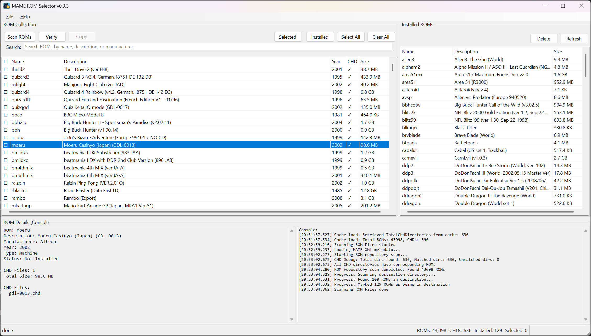

# MAME ROM Selector

<div align="center">
  
  <h3>A Windows Forms application for managing and organizing MAME ROM collections</h3>
</div>

This tool helps you scan, verify, and copy ROMs from your source directory to a destination directory, with support for CHD files and comprehensive metadata matching.

## Screenshot

<div align="center">
  
  <p><em>Main application interface showing ROM collection, installed ROMs, and detailed information panels</em></p>
</div>

## Features

- **ROM Scanning**: Scan directories for ROM files and match them with MAME XML metadata
- **Metadata Matching**: Automatically match scanned ROMs with MAME XML game information
- **ROM Verification**: Verify ROM integrity using CRC checks against MAME XML data
- **ROM Copying**: Copy selected ROMs and associated CHD directories to destination
- **CHD Support**: Full support for CHD (Compressed Hunks of Data) files and directories
- **Search & Filter**: Search and filter ROM collections by name, description, or other criteria
- **Batch Operations**: Select multiple ROMs for batch copying or verification
- **Cache System**: Intelligent caching system for faster subsequent scans
- **Settings Management**: Configure ROM repository, destination, and MAME XML paths

## 🤖 AI-Generated Development

**This entire repository was developed using AI-assisted programming!**

This project serves as a comprehensive example of modern AI-assisted software development, showcasing the capabilities of AI coding assistants in creating production-ready applications.

### Development Process
- **Primary Tool**: [Cursor IDE](https://cursor.sh/) with Claude Sonnet integration
- **AI Assistant**: Claude Sonnet 4 (Anthropic) for code generation, debugging, and architecture decisions
- **Development Approach**: Iterative AI-human collaboration with real-time code generation and refinement
- **Code Quality**: Production-ready C# Windows Forms application with proper error handling, async patterns, and professional UI

### What Was AI-Generated
- **Complete Application Architecture**: Service layer, controllers, models, and UI components
- **Complex Features**: XML parsing, ROM scanning, metadata matching, caching system
- **UI/UX Design**: Professional Windows Forms interface with custom controls and layouts
- **Error Handling**: Comprehensive exception handling and user feedback systems
- **Documentation**: README, code comments, and technical documentation
- **CI/CD Pipeline**: GitHub Actions workflows for automated building and releasing
- **Project Configuration**: .NET project files, build settings, and deployment configurations

### AI Development Highlights
- **Rapid Prototyping**: From concept to working application in hours, not days
- **Code Quality**: Clean, maintainable code following C# best practices
- **Feature Completeness**: Full-featured application with professional polish
- **Problem Solving**: Complex debugging and optimization through AI assistance
- **Documentation**: Comprehensive documentation generated alongside the code

This project demonstrates how AI coding assistants can accelerate development while maintaining high code quality and professional standards. The entire codebase, from the initial architecture to the final deployment pipeline, was created through AI-human collaboration.

## Requirements

- .NET 8.0 or later
- Windows 10/11
- MAME XML file (typically `mame.xml` or similar)

## Installation

### Option 1: Download Pre-built Release
1. Go to the [Releases](https://github.com/chdao/mame-rom-selector/releases) page
2. Download `mame-rom-selector-windows.zip`
3. Extract the files and run `MameSelector.exe`

### Option 2: Build from Source
1. Clone this repository
2. Build the solution using Visual Studio or .NET CLI:
   ```bash
   dotnet build
   ```
3. Run the application:
   ```bash
   dotnet run --project MameSelector
   ```

## Usage

### Initial Setup

1. **Configure Settings**: Go to `File > Settings` to configure:
   - ROM Repository Path (source directory containing your ROM files)
   - Destination Path (where you want to copy selected ROMs)
   - MAME XML Path (path to your MAME XML file)

2. **Scan ROMs**: Click the "Scan ROMs" button to scan your ROM repository and match with MAME XML metadata

### Main Operations

- **Scan ROMs**: Performs a fresh scan of your ROM repository
- **Verify**: Checks CRC integrity of selected ROMs against MAME XML data
- **Copy ROMs**: Copies selected ROMs and CHD directories to destination
- **Selected**: Adds checkmarks to currently highlighted ROMs
- **Installed**: Shows only ROMs that are already in the destination
- **Select All/Clear All**: Batch selection controls

### ROM Collection Panel

The left panel shows your complete ROM collection with:
- ROM name and description
- Year and manufacturer information
- Clone relationships
- Selection status
- Search and filter capabilities

### Installed ROMs Panel

The right panel shows ROMs already copied to destination with:
- ROM name and description
- File size information
- Delete functionality
- Refresh capability

## Recent Improvements (v0.3.3)

- **Portable Mode**: Default portable mode with cache/settings alongside executable, optional AppData mode
- **High-Resolution Icons**: Professional icon display in About dialog with smart resolution selection
- **Application Icon**: Professional icon implementation with proper taskbar and window display
- **UI Cleanup**: Removed redundant toolstrip, streamlined interface
- **Button Organization**: Logical grouping of ROM management functions
- **Large Selection Warning**: Warns when copying more than 100 ROMs
- **Duplicate Operation Prevention**: Guards against multiple simultaneous operations
- **CHD Directory Management**: Proper handling of CHD directories during copy/delete
- **Performance Optimization**: Removed unnecessary hash calculations during startup
- **Clean Shutdown**: Fixed empty window flash during application exit

## Technical Details

- Built with .NET 8.0 and Windows Forms
- Uses XML parsing for MAME metadata
- Implements intelligent caching for performance
- Supports both ROM files (.zip) and CHD directories
- Thread-safe operations with progress reporting
- Professional application icon with multiple sizes (16x16 to 256x256)
- Clean resource management and proper disposal patterns

## Versioning

This project follows semantic versioning (SemVer) with the format `MAJOR.MINOR.PATCH`:

- **MAJOR**: Breaking changes or major feature additions
- **MINOR**: New features, backwards compatible
- **PATCH**: Bug fixes and minor improvements

### Current Version: v0.3.3

**Version History:**
- **v0.3.3**: Self-contained application with embedded icon, startup crash fixes
- **v0.3.0**: Initial stable release with core functionality

## Development

### AI-Assisted Development

This project was entirely developed using AI-assisted programming with Cursor IDE and Claude Sonnet. The development process demonstrates the power of modern AI coding assistants in creating production-ready applications.

**Key Development Statistics:**
- **Development Time**: Hours instead of days/weeks
- **Code Generation**: 100% AI-assisted with human guidance and refinement
- **Architecture**: Complete application architecture designed and implemented by AI
- **Quality**: Production-ready code with proper error handling and async patterns
- **Documentation**: Comprehensive documentation generated alongside the code

### CI/CD Pipeline

This project uses GitHub Actions for continuous integration and deployment:

- **Continuous Integration**: Automatically builds and tests the project on every push and pull request
- **Manual Releases**: Create releases with pre-built Windows executables when ready
- **Windows-focused**: Optimized for Windows Forms applications using .NET 8.0

### Workflows

- `ci.yml`: Basic build and test on Windows
- `build.yml`: Windows build and artifact creation
- `release.yml`: Manual release creation workflow

### Building

The project can be built using standard .NET commands:

```bash
# Restore dependencies
dotnet restore

# Build in Debug mode
dotnet build

# Build in Release mode
dotnet build --configuration Release

# Publish for specific platform
dotnet publish --configuration Release --runtime win-x64 --self-contained true
```

## Contributing

This is a personal project, but suggestions and improvements are welcome!

## License

This project is for personal use. Please respect MAME licensing and ROM distribution policies.
